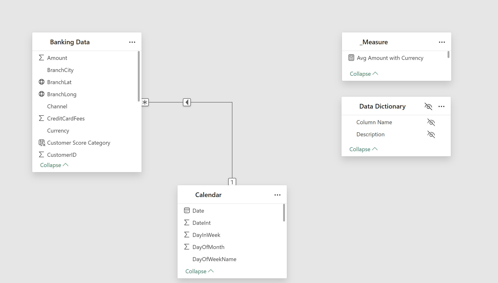

# Banking Analytics

## 1. Introduction  
This project takes on the role of a **Bank Data Analyst**, tasked with analyzing a comprehensive banking dataset that simulates real-world internal transaction data used by financial institutions. The goal is to uncover customer behavior patterns, evaluate risk and profitability, and extract strategic insights to support personalization, marketing optimization, and channel performance.

The dataset consists of 20,000 enriched transactions, including products such as checking accounts, loans, credit cards, and mortgages. Each transaction contains detailed attributes like income brackets, credit scores, transaction channels (ATM, Mobile, Branch), and recommended financial offers.

---

## 2. Problem Statement  
Banks need to better understand internal transactional data to:

- Identify customer segments that are most financially active  
- Determine the most popular financial products by segment  
- Evaluate the impact of credit scores on financial behavior  
- Analyze channel usage and regional transaction distribution  
- Identify top revenue drivers and friction points  
- Discover seasonal patterns to optimize campaigns and services

---

## 3. Skills Demonstrated  
- Data Cleaning & Transformation (Power Query, DAX)
- Power BI for interactive dashboards
- Data Modeling & Relationship Building (Star Schema)  
- Advanced DAX Measures
- Customer behavior and revenue segmentation  
- Channel & product usage analytics
- Business Insight Communication  
- Visual storytelling for strategic insight delivery

---

## 4. Data Sourcing  
The dataset includes 20,000 synthetic transaction records featuring:

`Banking Data` as Fact table containing : 

- Products: Loans, Savings, Credit Cards, Mortgages  
- Customer Attributes: Income level, Credit score, Segments  
- Transaction Types and Fees  
- City and Branch locations  
- Transaction Channels: Mobile, ATM, Branch, Online  
- Product Recommendations per customer

`Calendar`: Calendar table to support time intelligence

The Dataset Provide by **FP20 Analytics** 

More Information About This Challenge: [FP20 Analytics June 2025 Challenge](https://zoomcharts.com/en/microsoft-power-bi-custom-visuals/challenges/fp20-analytics-june-2025)

---

## 5. Data Transformation  
Data preparation was performed using **Power Query**, including:  
- Handling nulls and duplicates  
- Date normalization to connect with a calendar table  
- Mapping transaction types and categorizing channels  
- Calculating transaction-level fees and segment flags  
- Structuring key fields for modeling
- Generated custom columns `Customer Score Category` for better context

- 

- Calculate Total & Average (e.g., Amount, Transactions, Fee Revenue)

  - 

- Fee Revenue & Customer Breakdown

  - 

- Calculate YoY (e.g., Amount and Fee Revenue)

  - 

---

## 6. Data Modeling  
The data model follows a **Star Schema** structure:  
- **Fact Table**: `Banking Data`  
- **Dimension Tables**: `Calendar` 
- Relationships: One-to-Many with **Single filter direction**  
- Custom DAX Measures used for KPIs and segmentation-based analysis

 

---

## 7. Analysis & Visualization  
Built using Power BI, the dashboard consists of **Three main pages**:

### Page 1 – Customer Behavior & Segmentation  
**Key KPIs**: Total Transactions, Total Amount, Avg. Monthly Income, Avg. Credit Score, Repeat Customer Rate

- Transactions Over Time
- Transaction Distribution by Transaction Type & Channel, Customer Segment, Branch

**Insights Covered**:  
- *Most Active Segment*: The Middle Income Segment is the most transaction-active (8.885 transactions), followed by High Income (6.626) and Low Income (4.489)
- *Top Products*: Credit Cards (Middle), Savings (High/Low)  
- *Preferred Channels*: Mobile banking is the most dominant channel by both volume and value, followed by Branch, ATM, and Online banking.
- *Transaction Hotspots/Underperformers by City*: Murcia and Barcelona have the highest transaction volumes, while Barcelona and Malaga lead in total transaction value. Madrid and Bilbao show slightly lower activity.
- *Monthly Trends*: There is a clear seasonal pattern, with Q1 (January-March) showing the highest transaction volume and value. Activity generally decreases towards the mid and end of the year.

### Page 2 – Revenue & Cost Insights  
**Key KPIs**: Total Fee Revenue, Fee Ratio, Late Payment Fee Ratio, Avg. Fee Per Transactions, Fee Revenue Per Customer

- Fee Revenue & Transactions Over Time
- Fee Revenue Breakdown
- Recommended Offer vs Actual Product Used

**Insights Covered**:  
- *Top Revenue Drivers*: Loan Payment transactions drive the most fee-based revenue, significantly more than other transaction types.
- *Segment Cost Analysis*: The Middle Income Segment and Mobile channel consistently maintain their dominance in transaction volume over time. A general dip in activity was observed across all segments and channels in May 2025.
- *Revenue Friction Sources*: Late Payment Amounts are the most significant source of fee revenue, followed by Insurance Fees and Credit Card Fees.
- *Product Recommendation Alignment*: Some recommendations like Exclusive Platinum Package (Credit Card) and Personal Loan Cashback Offer (Loan) show good alignment. However, Mid-tier Savings Booster is most associated with Mortgage transactions, and Premium Investment Services with Savings Account transactions, suggesting potential misalignment or complex customer behavior.

### Page 3 – Product Transactions
Detailed analysis of financial products, including year-over-year (YoY) comparisons, transaction amounts, and fee-based revenue breakdowns. This page provides insights into the performance and profitability of each product category.

You can interact with report here [FP20 Analytics](https://app.powerbi.com/view?r=eyJrIjoiZDI4MTA5NjktY2YwYi00NWM0LTkxYTctNzMzYjAyNjM0YjU3IiwidCI6IjQ2NTRiNmYxLTBlNDctNDU3OS1hOGExLTAyZmU5ZDk0M2M3YiIsImMiOjl9)

 

---

## 8. Conclusion 

#### Customer Insights & Segmentation
 
- Middle-income customers contribute the most to transaction volume, highlighting their importance for daily banking operations.
- Savings accounts are a universal need, but the Middle Income segment's preference for Credit Cards suggests more active spending or credit utilization.
- There is no significant linear relationship between customer credit scores and either transaction frequency or accumulated fees . This suggests that credit scores do not strongly predict these specific behavioral aspects.

#### Transaction Behavior Analysis

- These are core activities, indicating frequent customer interaction with cash and credit facilities.
- There are regional differences in transaction activity that can inform localized strategies.
- The strong preference for mobile banking reinforces the ongoing shift towards digital channels.

#### Revenue & Cost

- Loan-related fees are a primary revenue driver for the bank.
- No single customer group is disproportionately incurring costs on a per-transaction basis, but higher transaction volumes from middle-income customers lead to higher total fees.
- Late payments represent a major source of revenue but also indicate potential customer friction.

#### Trend & Performance

- The bank can leverage seasonal peaks for targeted campaigns and resource planning.
- The recommendation engine requires review to ensure it effectively guides customers to intended products.
- The sustained preference for mobile banking and the high activity of the middle-income segment are consistent trends for strategic focus.

## 9. Recommendations

- **Optimize Engagement with Middle-Income Customers**  
   **Recommendation**: Develop tailored marketing campaigns and product offerings focusing on credit card benefits and bundled services for the Middle Income Segment. This segment is a significant driver of overall transaction volume and fee generation.

- **Strategize Around Loan-Related Fees and Reduce Late Payment Friction**  
   **Recommendation**: Analyze the specific fees associated with loan payments to ensure transparency and fairness. Implement proactive measures like enhanced payment reminders or flexible payment options to reduce Late Payment Amounts, minimizing customer friction while managing revenue.

- **Enhance and Prioritize Digital Channels, Especially Mobile**  
   **Recommendation**: Continue to invest heavily in mobile banking features, user experience, and security. Explore expanding services exclusively through the mobile app. Evaluate the role of physical branches for complex transactions and advisory services rather than routine transactions.

- **Refine the Product Recommendation Engine**  
   **Recommendation**: Conduct a thorough review of the recommendation engine's algorithms and data. Aim to better align `RecommendedOffer` with actual customer needs and the bank's desired product adoption, especially for offers showing misalignment (e.g., Mid-tier Savings Booster and Premium Investment Services). Consider A/B testing and customer feedback.

- **Leverage Seasonal Transaction Patterns for Strategic Planning**  
   **Recommendation**: Plan marketing campaigns, product launches, and customer service staffing to capitalize on the Q1 transactional peak. Conversely, utilize slower periods for internal process improvements or customer retention initiatives.

- **Deep Dive into City-Level Performance**  
   **Recommendation**: Investigate the reasons for lower transaction activity in cities like Madrid and Bilbao. This could involve analyzing local demographics, economic conditions, and competitor landscapes to inform targeted marketing efforts or service optimizations in these areas.

---

### Repository Contents  
- **Power BI Dashboard File**: The main [PBIX File](Banking_Dashboard.zip) containing the analysis and visualizations. 
- **Data Sources**: [Raw Dataset](FP20Analytcis_Banking_Dataset_Challenge27_English.zip) used in the project.  
- **Screenshots/Reports**: Exported visualizations for sharing insights.  
- **README.md**: Project documentation (this file).
